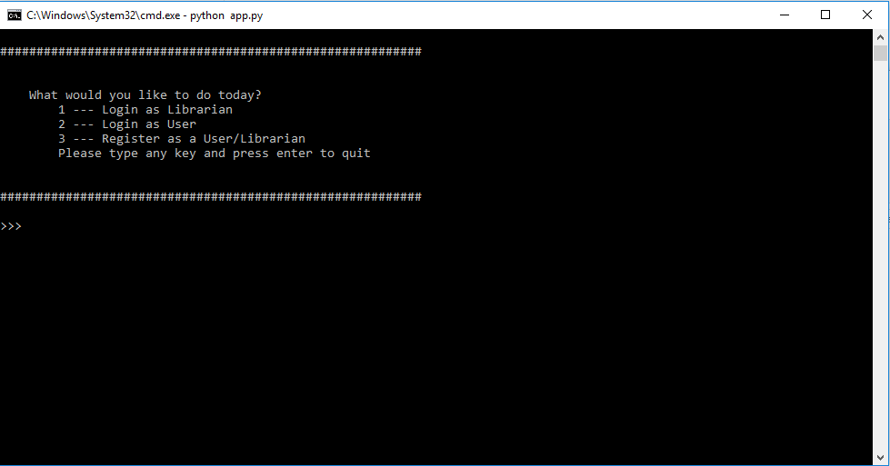
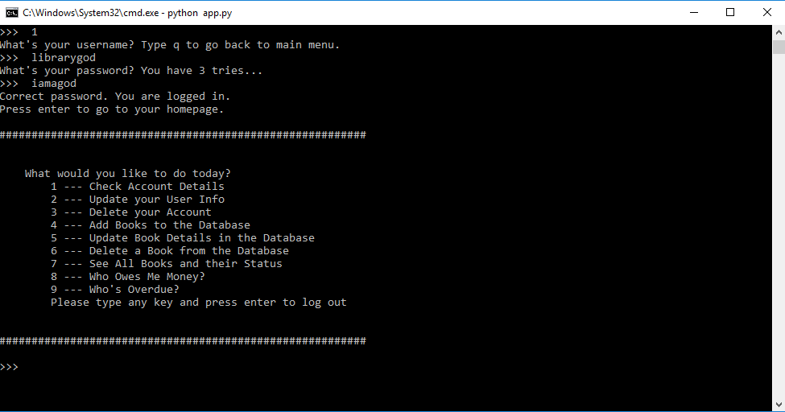
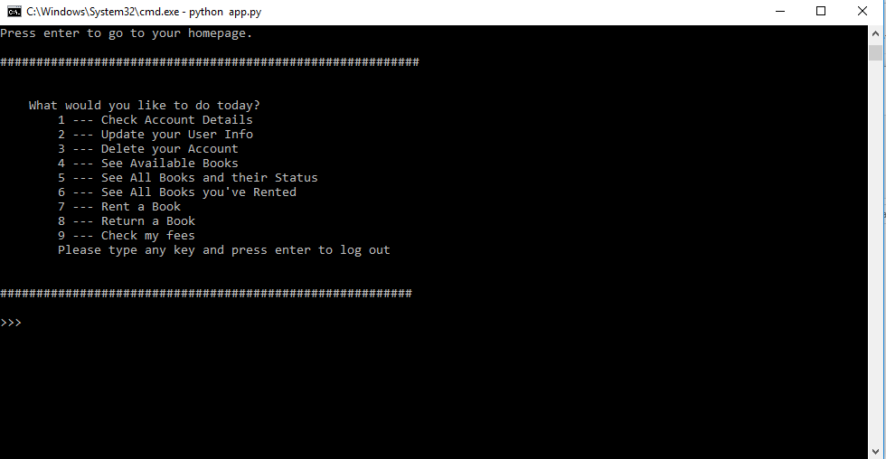

# Terminal Management System
### Description
This repository contains the code used to build a simple management system for book rentals in a fake library as a mini-project for a foundation Python course. The project is a terminal application coded on Python using the Pandas library and SQLite.

### Files
There are 3 main files in the repository:
- `app.py`: Contains all the functions and classes used to run the program
- `create_database.py`: Contains the code to create the SQLite database and populate it with some data
- `terminal_management_system.db`: An SQLite database populated with users, librarian, and books tables and information created in the `create_database.py` file

### Setting Up and Using the Program
- Clone/fork this respository onto your local computer 
- Open up terminal and run `python create_database.py` to create the database
- Run `python app.py` to use the program

### Program Features
The program has a main menu with the following options:
1) Login as a User
2) Login as a Librarian
3) Register as a User/Librarian

Users and librarians can login and will be redirected to separate views with different options. Users can rent books, return books, update their info, etc. while librarians can add books, check books rented for too long, check user fees, etc. The images below demonstrate the views/features in the terminal application.

__**Main Page:**__

__**Librarian View:**__

__**User View:**__

